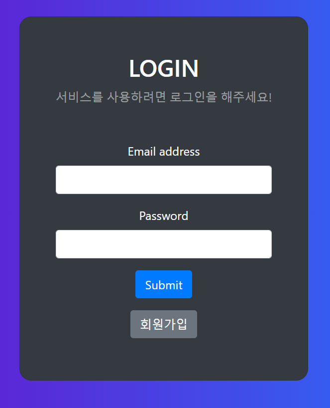
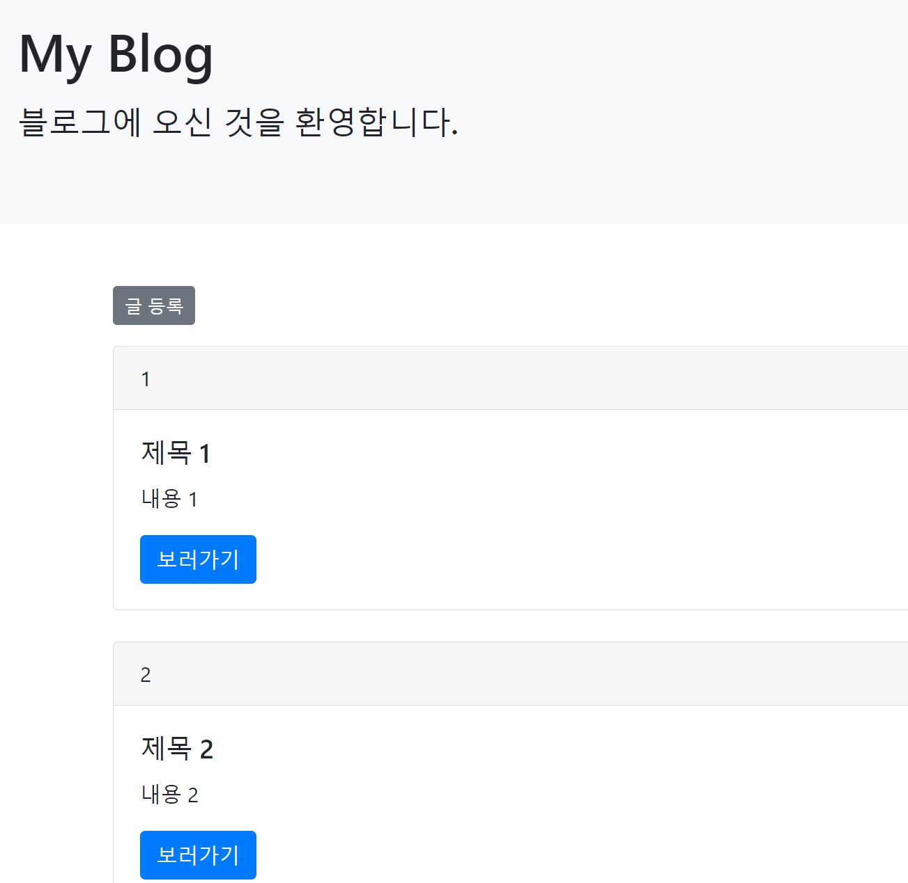

## 목차
- [목차](#목차)
- [프로젝트 개요](#프로젝트-개요)
- [주요 기능](#주요-기능)
- [프로젝트 목표](#프로젝트-목표)
- [기술 스택](#기술-스택)
  - [Spring Boot](#spring-boot)
- [프로젝트 결론](#프로젝트-결론)
- [프로젝트 문제점](#프로젝트-문제점)

<br>
<br>

## 프로젝트 개요
스프링 부트를 이용한 블로그는 사용자가 로그인, 회원가입을 통해 블로그에서 글을 남기고 수정하는 기능을 위해서 구현하였습니다.

## 주요 기능
- 사용자가 글을 조회, 등록, 수정, 삭제를 할 수 있는 블로그 CRUD 기능
- 스프링 시큐리티를 이용한 로그인, 회원가입, 로그아웃 기능
- JWT를 이용해 액세스 토큰, 리프레시 토큰 발급 기능

## 프로젝트 목표
개인 프로젝트로써 스프링 부트를 사용한 서버 구성 경험을 쌓기 위해 진행하였으며 사용자가 로그인, 회원 관리를 통해 블로그를 사용할 수 있도록 제공하는 것이 목표입니다.

## 기술 스택


<br>
<br>
<br>

***
### Spring Boot
스프링 부트로 프레젠테이션 계층(controller), 비즈니스 계층(service), 퍼시스턴스 계층(repository)으로 각각 나누어서 서버를 구성하였다.  
HTTP 요청이 들어오면 프레젠테이션 계층에서 요청을 받고 서비스은 실제 구현을 담당하고 리포지토리에 값을 전달하여 db와 관련된 일을 처리하고 웹페이지로 응답해준다.

- 데이터베이스는 h2 데이터베이스로 구현하였으며 스프링부트에서 제공하는 인메모리 데이터베이스이다. 간단한 테스트를 위해 사용하였으며 추후에 MySQL이나 oracleDB로 변경할 계획이다.

- 객체와 관계형 데이터베이스 간의 매핑을 자동으로 처리해주는 JPA를 이용하였다.  
예) /domain/Article.java

```java
@Entity
@Getter
@NoArgsConstructor(access = AccessLevel.PROTECTED)
public class Article {

    @Id
    @GeneratedValue(strategy = GenerationType.IDENTITY)
    @Column(name = "id", updatable = false)
    private Long id;

    @Column(name = "title", nullable = false)
    private String title;

    @Column(name = "content", nullable = false)
    private String content;
```

- 스프링 부트 서버에서 데이터를 HTML 상에 넣어서 보여주는 템플릿 엔진인 타임리프를 사용하여 웹 페이지를 구성하였다.  
예) /templates/articleList.html

```html
<!DOCTYPE html>
<html xmlns:th="http://www.thymeleaf.org">

<div class="container">
    <button type="button" id="create-btn"
            th:onclick="|location.href='@{/new-article}'|"
            class="btn btn-secondary btn-sm mb-3">글 등록
    </button>
    <div class="row-6" th:each="item : ${articles}">
        <div class="card">
            <div class="card-header" th:text="${item.id}">
            </div>
            <div class="card-body">
                <h5 class="card-title" th:text="${item.title}"></h5>
                <p class="card-text" th:text="${item.content}"></p>
                <a th:href="@{/articles/{id}(id=${item.id})}" class="btn btn-primary">보러가기</a>
            </div>
        </div>
        <br>
    </div>

    <button type="button" class="btn btn-secondary" onclick="location.href='/logout'">로그아웃</button>
</div>
```

- 스프링 시큐리티를 이용해 로그인과 회원가입, 로그아웃 기능을 구현하였다.  
예) 스프링 시큐리티 설정파일 /config/WebSecurityConfig.java
```java
@RequiredArgsConstructor
@Configuration
public class WebSecurityConfig {

    private final UserDetailService userService;

    // 시큐리티 기능 비활성화
    @Bean
    public WebSecurityCustomizer configure() {
        return (web) -> web.ignoring()
                .requestMatchers(toH2Console())
                .requestMatchers("/static/**");
    }

    // 특정 HTTP 요청에 대한 웹 기반 보안 구성
    @Bean
    public SecurityFilterChain filterChain(HttpSecurity http) throws Exception {
        return http
                .authorizeRequests()
                .requestMatchers("/login", "/signup", "/user").permitAll()
                .anyRequest().authenticated()
                .and()
                .formLogin()
                .loginPage("/login")
                .defaultSuccessUrl("/articles")
                .and()
                .logout()
                .logoutSuccessUrl("/login")
                .invalidateHttpSession(true)
                .and()
                .csrf().disable()
                .build();
    }

    // 인증 관리자 관련 설정
    @Bean
    public AuthenticationManager authenticationManager(HttpSecurity http, BCryptPasswordEncoder bCryptPasswordEncoder, UserDetailService userDetailService) throws Exception {
        return http.getSharedObject(AuthenticationManagerBuilder.class)
                .userDetailsService(userService)
                .passwordEncoder(bCryptPasswordEncoder)
                .and()
                .build();
    }

    // Password 인코더로 사용할 Bean 등록
    @Bean
    public BCryptPasswordEncoder bCryptPasswordEncoder() {
        return new BCryptPasswordEncoder();
    }
}
```


<br>
<br>

- JWT 액세스 토큰 및 리프레시 토큰 발급 과정
1. 클라이언트로부터 서버에 인증 요청이 들어오면 인증 정보를 확인한 후, 액세스 토큰과 리프레시 토큰을 만들어서 클라이언트에게 전달하고 클라이언트는 이를 저장한다.  
2. 서버에서 생성한 리프레시 토큰은 DB에 저장하고 인증이 필요한 API를 호출할 때에 클라이언트에 저장된 액세스 토큰과 함께 API를 요청한다.
3. 서버는 전달받은 액세스 토큰이 유효한지 검사하고 유효하다면 클라이언트에서 요청된 내용을 처리한다.
4. 시간이 지나고 액세스 토큰이 만료된 뒤에 서버에게 API 요청을 보내면 서버는 유효한지 검사하고 토큰이 만료되었다는 에러를 전달한다.
5. 클라이언트는 응답을 받고 저장해둔 리프레시 토큰과 함께 새로운 액세스 토큰 발급을 요청한다.
6. 서버는 리프레시 토큰이 유효한지 DB에 저장해둔 리프레시 토큰과 비교하여 같은지 확인한다.
7. 리프레시 토큰이 유효하다면 새로운 액세스 토큰을 생성하여 응답한다.

## 프로젝트 결론


처음 의도하였던 것처럼 블로그의 CRUD 기능과 로그인, 회원가입, 로그아웃 기능 모두 구현이 잘 되었습니다.

## 프로젝트 문제점
프로젝트를 진행하며 스프링 시큐리티와 JWT 토큰 인증 방식의 이해에 대해 어려움을 느꼈지만 여러 자료들과 인터넷을 찾아보며 스프링 시큐리티와 JWT 토큰 인증 방식에 대해 확실히 이해 할 수 있는 계기가 되었다. 부족한 기능이나 간단한 CRUD 블로그이기 때문에 차후에 블로그 내에 과거에 프로젝트를 진행하였던 퀴즈 웹 사이트 '마즐래 마출래'같은 재미 요소도 추가할 예정이다.